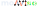

<picture>
  <source media="(prefers-color-scheme: light)" srcset="docs/_static/monviso-light.svg">
  
</picture>

A Python package for solving monotone variational inequalities. 

## Documentation
Documentation and quick-start guide can be found on the [docs website](https://monviso.readthedocs.io/en/latest/).