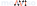

<div align="center">

<picture>
  <source media="(prefers-color-scheme: light)" srcset="docs/images/monviso-light.svg">
  
</picture>

**A Python package for solving monotone variational inequalities.**

<a href='https://monviso.readthedocs.io/en/latest/?badge=latest'>
  
</a>

</div>

## Installation
```
pip install git+https://github.com/nicomignoni/monviso.git@master
```

## Documentation
A quick-start guide, together with a list of the implemented algorithms, can be found on the [docs website](https://nicomignoni.github.io/monviso/).
