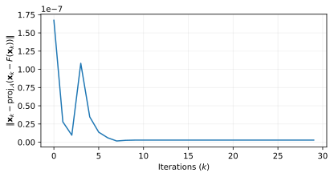

.. monviso documentation master file, created by
   sphinx-quickstart on Tue Oct  8 19:25:41 2024.
   You can adapt this file completely to your liking, but it should at least
   contain the root `toctree` directive.

Welcome to ``monviso``!
=================================

.. meta::
   :description: An open source Python package for solving monotone variational
                 inqualities.
   :keywords: monotone variational inequalities, open source, software,

Quickstart
----------

Let :math:`F(\mathbf{x}) = \mathbf{H} \mathbf{x}` for some 
:math:`\mathbf{H} \succ 0`, :math:`g(\mathbf{x}) = \|\mathbf{x}\|_1`, 
and :math:`\mathcal{S} = \{\mathbf{x} \in \mathbb{R}^n : \mathbf{A} \mathbf{x} 
\leq \mathbf{b}\}`, for some :math:`\mathbf{A} \in \mathbb{R}^{m \times n}` and 
:math:`\mathbf{b} \in \mathbb{R}^n`. It is straightforward to verify that 
:math:`F(\cdot)` is strongly monotone with :math:`\mu = \lambda_{\min}(\mathbf{H})` 
and Lipschitz with :math:`L = \|\mathbf{H}\|_2`. The solution of the VI 
in can be implemented using ``monviso`` as follows

.. literalinclude:: ../examples/quickstart.py
   :language: python

where in the last code block we check the logs collected in ``result.log``,
plotting the residual at each iteration

.. toctree::
   :maxdepth: 1
   :hidden:
   
   algorithms
   examples/index